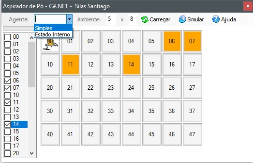
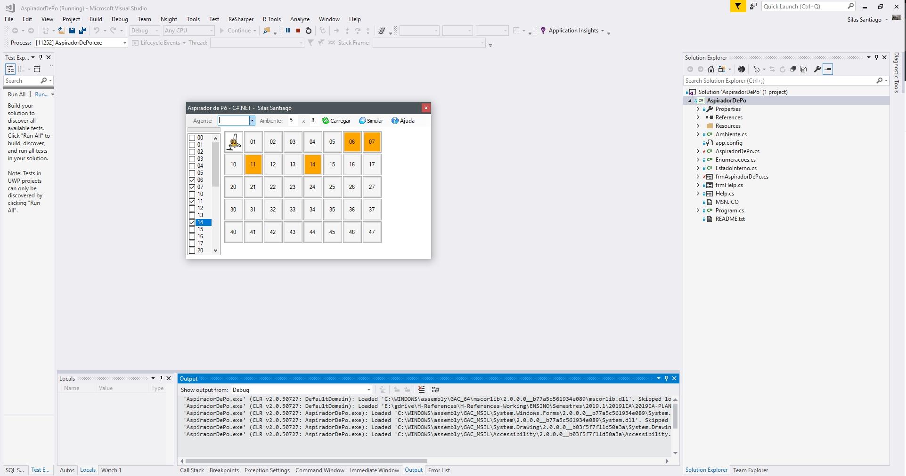

# 2019.1 - Atividade de Inteligência Artificial - Agentes Inteligentes

Este é um simples projeto de um agente inteligente reativo simples Aspirador de Pó:

Este projeto foi desenvolvido com a IDE Visual Studio:

